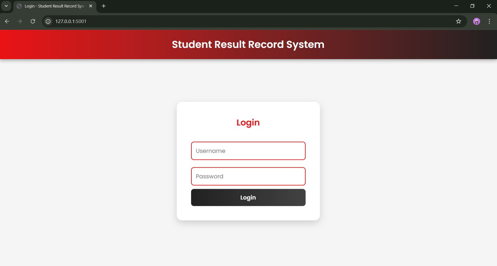
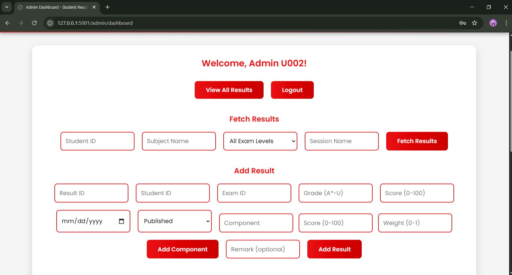
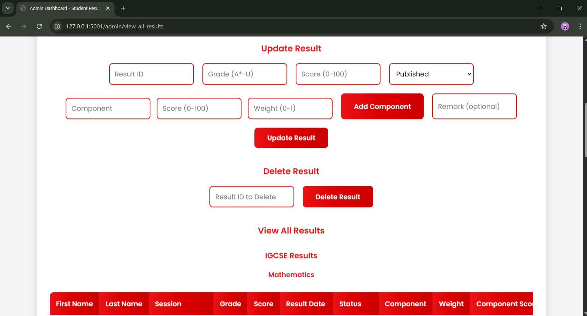
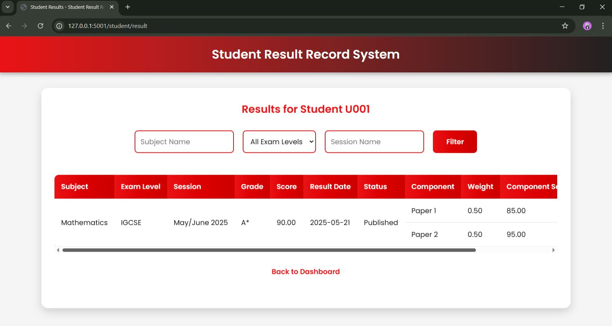

<h1 align="center">Student Result Record System</h1>

<p align="center">
  A dynamic and secure web application engineered with Python/Flask and a MySQL backend, designed to streamline the management of student academic records.
</p>

<p align="center">
  
  
  
  
  
</p>

---

## 🚀 Key Features

This project is built with a focus on security, data integrity, and a clear separation of concerns.

* **🔑 Role-Based Access Control (RBAC)**: Secure routes and distinct dashboards for **Admin** and **Student** roles.
* **⚙️ Powerful Admin Dashboard**: A feature-rich interface for complete control over student records including full CRUD functionality.
* **🧑‍🎓 Efficient Student Portal**: A clean, intuitive, and personalized dashboard for students to view their academic standing.
* **🗃️ Robust Database Integration**: Powered by a relational MySQL database with advanced SQL queries for efficient data aggregation.
* **🛡️ Server-Side Validation**: Strong backend validation to maintain high data integrity.
* **✍️ Action Logging**: Admin actions are logged in the database, creating a basic audit trail.

---

## 📸 Application Preview

Here’s a glimpse of the Student Result Record System in action.

### Login Page
*The secure gateway for both admins and students.*
<p align="center">
  
</p>

### Admin Dashboard
*The control center showcasing CRUD forms, result filtering, and categorized views.*
<p align="center">
  
</p>
<p align="center">
  
</p>

### Student Dashboard & Results
*The student view, highlighting the personalized dashboard and result filtering capabilities.*
<p align="center">
  
</p>

---

## 🛠️ Tech Stack

* **Backend**: Flask (Python)
* **Database**: MySQL
* **API Layer**: RESTful endpoints returning JSON
* **Frontend**: HTML, CSS
* **Python Libraries**: Flask, mysql-connector-python

---

## ⚙️ Getting Started

To get a local copy up and running, follow these simple steps.

### Prerequisites

* Python 3.9+
* MySQL Server
* Git

### Installation

1.  **Clone the repository:**
    ```sh
    git clone [https://github.com/your-username/StudentResultSystem.git](https://github.com/your-username/StudentResultSystem.git)
    cd StudentResultSystem
    ```

2.  **Create and activate a virtual environment:**
    ```sh
    # For Windows
    python -m venv venv
    venv\Scripts\activate

    # For macOS/Linux
    python3 -m venv venv
    source venv/bin/activate
    ```

3.  **Install the required packages:**
    ```sh
    pip install -r requirements.txt
    ```

4.  **Set up the database:**
    * Make sure your MySQL server is running.
    * Create a new database named `StudentRecordSystem`.
    * Update the `db_config` dictionary in `app.py` with your MySQL credentials.
    * **Important**: You will need to create the database tables based on the SQL queries found in the `app.py` file.

5.  **Run the application:**
    ```sh
    flask run --port 5001
    ```
    The application will be available at `http://127.0.0.1:5001`.

---

## ✨ Upcoming Features

This project has a strong foundation. Future enhancements could include:

* **🔒 Enhanced Security**: Implement password hashing using a library like `bcrypt`.
* **📧 Email Notifications**: Automatically send email alerts to students.
* **📊 Data Visualization**: A graphical dashboard for admins and students.
* **📤 Bulk Import/Export**: Allow bulk upload/download of results via CSV/PDF.
* **👨‍💼 Advanced User Management**: A dedicated admin interface for managing users.
* **📚 Subject & Exam Management**: A UI for admins to manage subjects and exams.
* **📄 API Documentation**: Create formal API documentation using Swagger or Postman.

---

## 🤝 How to Contribute

Contributions are what make the open-source community such an amazing place to learn, inspire, and create. Any contributions you make are **greatly appreciated**.

1.  **🍴 Fork the Project**
2.  **🌿 Create your Feature Branch** (`git checkout -b feature/AmazingFeature`)
3.  **✨ Commit your Changes** (`git commit -m 'Add some AmazingFeature'`)
4.  **🚀 Push to the Branch** (`git push origin feature/AmazingFeature`)
5.  **🎉 Open a Pull Request**
